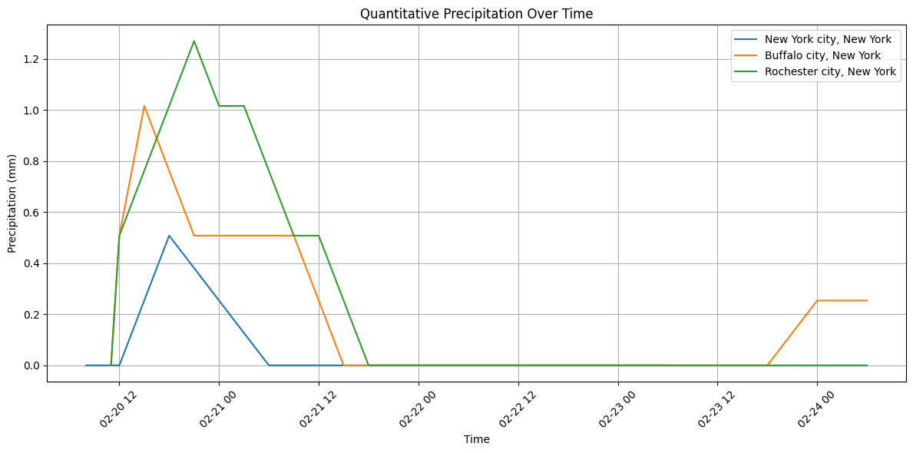

# Weather Data Processing and Analysis

## Overview

This project is designed to efficiently retrieve, process, and analyze weather data using NOAA's API services while optimizing API calls and memory usage. It integrates population census data, AOI (Area of Interest) data, and geographic mapping to streamline data acquisition and storage.

## Key Features

### 1. Optimized Data Retrieval
- Leveraged population census data and AOI data to minimize API calls to NOAA
- Prioritized high-population areas to reduce redundant requests and enhance efficiency

### 2. US Cities Database with NOAA Mapping
- Compiled a database of all US cities with their geographic coordinates
- Mapped standard latitude/longitude coordinates to NOAA's unique grid system used in their weather models
- Ensured precise alignment between localities and NOAA's data structure

### 3. MongoDB Integration for Data Storage
- Established a MongoDB pipeline to store queried weather data for further analysis
- Enabled efficient historical tracking and data retrieval without redundant API calls
- Provided structured data storage for multiple datasets, including:
  - Hourly weather forecasts
  - Daily weather forecasts
  - Quantitative precipitation forecasts

### 4. Data Visualization and Analysis
- Developed charts and analytics tools to extract insights from the data
- Examples include:
  - Temperature evolution over time
  - Precipitation probability analysis
  - Wind speed trends
  - Cloud cover variations

## Example Charts

Below are some visual outputs from the dataset analysis:

## How to Use This Project

- Focus on highly populated areas to optimize API calls and memory usage
- Leverage MongoDB storage to reduce redundant queries and streamline access to historical data
- Extend the dataset by integrating additional external data sources for richer insights

## Next Steps

### Risk Monitoring
- Identify weather anomalies such as extreme precipitation, temperature spikes, or disaster-prone weather conditions
- Implement alerts for unusual weather events (e.g., flooding risk, heatwaves)

### Demographic and Climate Risk Analysis
- Cross-reference weather data with population demographics to assess potential risks, such as:
  - High temperatures affecting elderly populations
  - Unusual precipitation patterns correlated with flooding risks

### Correlation with Other Indicators
- Investigate possible correlations between weather patterns and socio-economic indicators (e.g., economic activity, energy consumption, public health trends)
